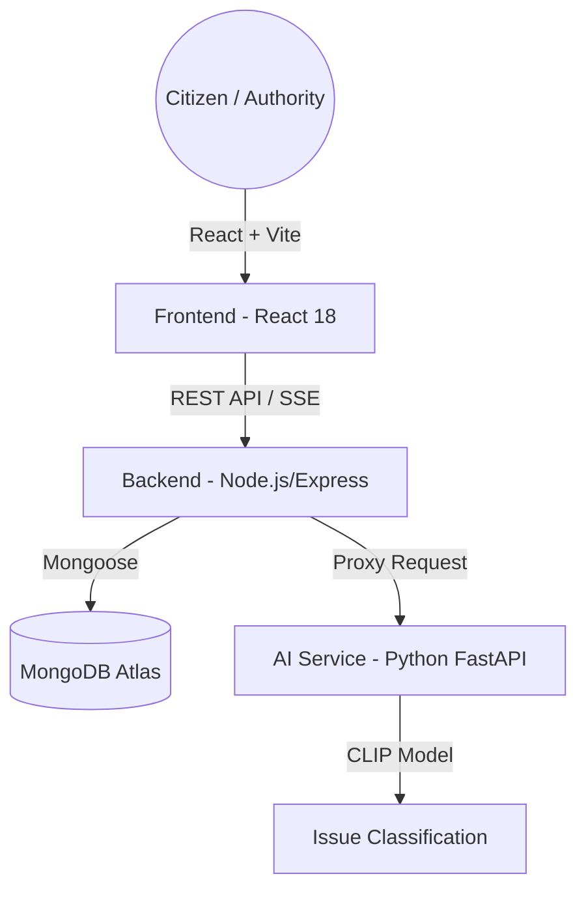

# 🛡️ SpotFix: Smart Civic Issue Reporting System

[](https://reactjs.org/)
[](https://vitejs.dev/)
[](https://nodejs.org/)
[](https://www.mongodb.com/)
[](https://www.python.org/)
[](https://fastapi.tiangolo.com/)

**SpotFix** is a next-generation civic platform designed to bridge the gap between citizens and municipal authorities. By leveraging AI-powered classification and real-time tracking, it transforms how urban issues—from potholes to broken streetlights—are reported, managed, and resolved.

---

## 🚀 Key Value Propositions

*   **🤖 AI-Driven Efficiency**: Automatic category detection using the CLIP model ensures reports reach the right department instantly.
*   **📡 Real-Time Transparency**: Live status updates via Server-Sent Events (SSE) keep citizens informed at every step.
*   **🗺️ Interactive Mapping**: A comprehensive geospatial view of all reported issues for both citizens and authorities.
*   **🏆 Community Engagement**: A Karma-based rewards system and leaderboard to encourage active civic participation.

---

## 🛠️ Technical Architecture



### 🎨 Frontend Stack
- **Framework**: React 18 with Vite 6
- **Styling**: Tailwind CSS 4.0 (Modern, High-performance utility CSS)
- **Icons**: Lucide React
- **Maps**: React-Leaflet (Interactive Geospatial Visualization)
- **State/Routing**: React Router 7
- **Feedback**: Sonner (Premium Toast Notifications) & Framer Motion (Smooth Transitions)

### ⚙️ Backend Stack
- **Runtime**: Node.js & Express
- **Database**: MongoDB with Mongoose ODM
- **Authentication**: JWT (JSON Web Tokens) with custom middleware
- **Real-time**: Server-Sent Events (SSE) for live status broadcasting
- **File Handling**: Multer for high-performance image uploads

### 🤖 AI Service
- **Framework**: FastAPI (Asynchronous Python)
- **Model**: OpenAI's CLIP (Contrastive Language-Image Pre-training)
- **Logic**: Zero-shot classification for visual civic issues

---

## 👥 Role-Based Features

### 👤 Citizen Portal
- **Smart Reporting**: Upload photos; AI detects if it's "Roads", "Water", "Garbage", etc.
- **My Reports**: Track personal submission history and karma earnings.
- **Community Feed**: See what's happening in your neighborhood (anonymized for privacy).
- **Interactive Map**: Visualize issues around your current GPS location.

### 🏢 Authority Portal
- **Departmental Queues**: Automatically see issues assigned to your specific department (e.g., PWD, Sanitation).
- **Workflow Management**: Update status from `Submitted` ➡️ `In Progress` ➡️ `Resolved`.
- **Proof of Resolution**: Mandatory resolution notes and "After" photo uploads.

### 👑 Admin Dashboard
- **City-wide Analytics**: High-level overview of total reports, resolution rates, and performance trends.
- **Staff Management**: Provision and manage accounts for different departments.
- **Global Heatmap**: Identify infrastructure failure hotspots across the city.

---

## 🏁 Getting Started

### Prerequisites
- Node.js v18+
- Python 3.10+
- MongoDB Atlas Account (or local MongoDB)

### 📦 Installation

1. **Clone and Install All Dependencies**
   ```bash
   git clone <your-repo-url>
   cd Spotfix-Atharv
   npm run install-all
   ```

2. **Configure Environment**
   Create a `.env` file in the `backend/` directory:
   ```env
   MONGODB_URI=your_mongodb_connection_string
   PORT=5000
   JWT_SECRET=your_jwt_secret
   ```

3. **Install AI Dependencies**
   ```bash
   pip install torch transformers fastapi uvicorn python-multipart pillow
   ```

### 🚀 Running the Platform

From the root directory, run:
```bash
npm run dev
```
This single command orchestrates:
- **Frontend**: [http://localhost:5173](http://localhost:5173)
- **Backend**: [http://localhost:5000](http://localhost:5000)
- **AI Service**: [http://localhost:8000](http://localhost:8000)

---

## 📸 Screenshots & UI

| Citizen Dashboard | Authority Queue |
|---|---|
|  |  |

> *Note: High-density glassmorphic UI designed for modern browsers.*

---

## 📜 License
This project is licensed under the ISC License. 

---
Developed for **Smart Civic Engagement** 🇮🇳
